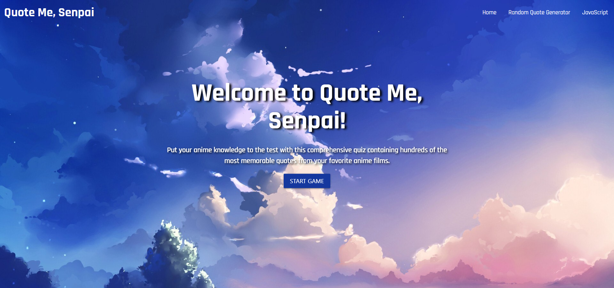

# Project 1: Quote Me Senpai!
Quotes and Photos from your favorite anime shows

## Overview
Create a Quiz to test Anime Knowledge... Do you know who said what?
Ensure Webpage is Functioning as Intended (ie: all links work, etc)
Create an End Product that works on Desktop and Mobile
Use Framework other than Bootstrap (we chose to utilize Materialize https://materializecss.com/ )
Have Features that Utilize Local Storage

## Technologies Used
-HTML
-CSS
-Javascript
-Materialize CSS Framework
-Nekos Best API
-AnimeChan API
-Google Fonts
-JSON

## Team Members
Ben Holgate
Robert Bishop
Mary Villoso
Alka Sah
Priyanka Ghale
Abby Douglas

## Installation

1. Clone this repository to your computer's desktop.
2. Navigate to the top level directory.
3. Open the index.html file in a browser.

## Usage

## Link to Web App:  https://holgateb.github.io/quote-me-senpai/

## API - get quotes by anime title
fetch('https://animechan.vercel.app/api/quotes/anime?title=naruto')
     .then(response => response.json())
     .then(quotes => console.log(quotes))

## API - get quotes by character name
fetch('https://animechan.vercel.app/api/quotes/character?name=saitama')
     .then(response => response.json())
     .then(quotes => console.log(quotes))

## API - get anime images and gifs
https://nekos.best/api/v2/thumbsup?amount=20https://nekos.best/api/v2/thumbsup
